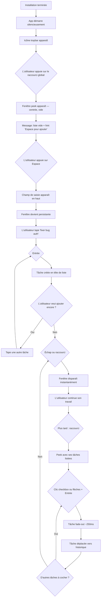
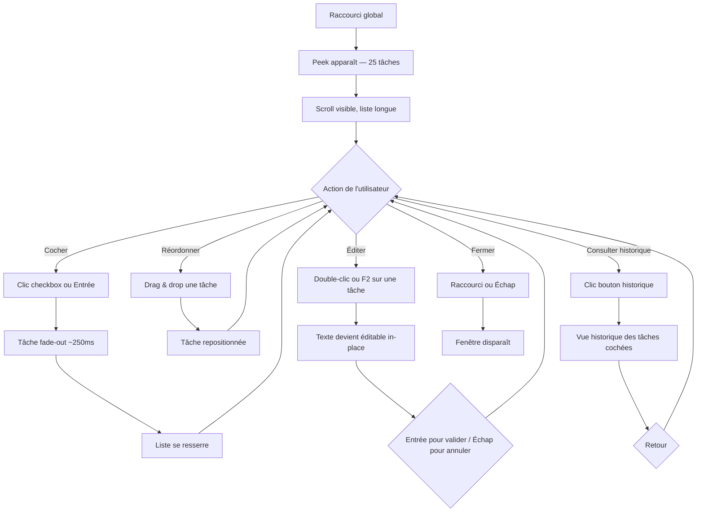
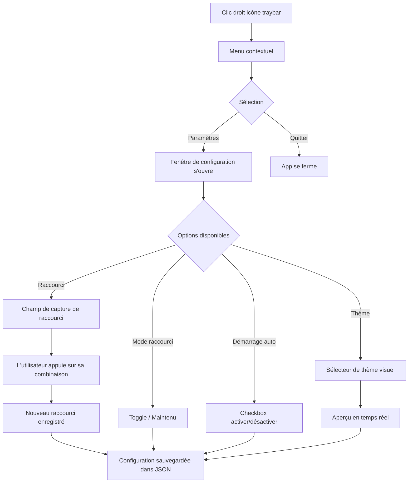
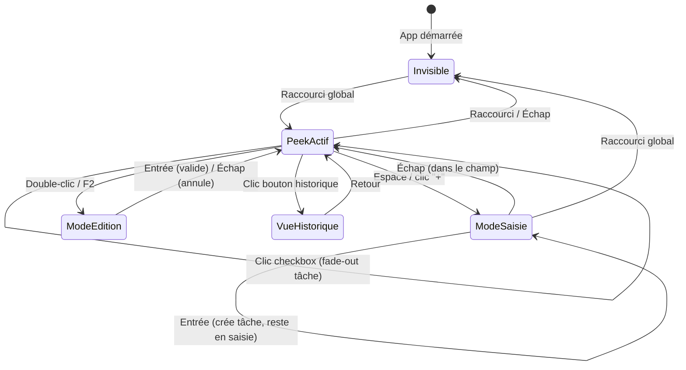

# UX Design Specification tinyTodo

**Author:** Yvan.betremieux
**Date:** 2026-03-04

---

<!-- UX design content will be appended sequentially through collaborative workflow steps -->

## Executive Summary

### Vision produit

tinyTodo est une app de bureau qui n'existe que pour un geste : raccourci → peek → action → fermer. Pas de fenêtre principale, pas de rappels, pas de cloud. L'expérience UX repose entièrement sur la vitesse d'accès (< 200ms), la simplicité radicale (checkbox + texte brut), et l'invisibilité de l'app dans le quotidien de l'utilisateur. Le meilleur design ici est celui qui disparaît.

### Utilisateurs cibles

**Profil principal — Marc (développeur débordé) :**
- Tech-savvy, habitué aux raccourcis clavier, travaille sur desktop (macOS/Windows/Linux)
- Frustré par les todo apps qui demandent trop d'attention et de configuration
- Besoin : capturer une pensée en 3 secondes sans quitter son flow de travail
- Utilisation : intermittente et intense — par vagues lors des périodes chargées, puis silence

**Profil secondaire — Léa (contributrice open source) :**
- Utilisatrice qui devient contributrice grâce à la simplicité du code
- Le design UX doit refléter la philosophie technique : propre, lisible, sans surplus

### Défis de design clés

1. **Paradoxe peek/saisie** — La fenêtre éphémère doit devenir persistante en mode saisie, avec une transition invisible et naturelle entre les deux modes.
2. **Navigation duale clavier/souris** — Interface parfaitement utilisable dans les deux modes sans compromis. Power users au clavier uniquement, utilisateurs casual à la souris uniquement.
3. **Cohérence cross-platform** — Le comportement de la fenêtre flottante (focus, blur, z-order, positionnement) doit rester cohérent sur macOS, Windows et Linux.

### Opportunités de design

1. **L'instantanéité comme sensation** — Avec < 200ms d'affichage et < 100ms par action, l'app peut créer une sensation de "zéro latence" unique et différenciante.
2. **La disparition comme feedback** — Une tâche cochée qui disparaît est un micro-feedback intrinsèque satisfaisant, amplifiable par une animation subtile de fade-out.
3. **Le minimalisme comme identité** — L'absence d'UI superflue EST le design. Checkbox + texte brut = mémorable et différenciant.

## Core User Experience

### Expérience définissante

L'expérience centrale de tinyTodo tient en un geste : **raccourci → peek → action → fermer**. Ce cycle est le seul flow qui compte. Chaque décision de design doit servir la fluidité de cette boucle.

Trois actions à l'intérieur du peek :
- **Consulter** — voir la liste des tâches actives d'un coup d'œil
- **Capturer** — barre d'espace ou "+" → taper → Entrée → la tâche est créée, LIFO
- **Cocher** — clic ou flèches + Entrée → la tâche disparaît de la vue

La fermeture (raccourci ou Échap) met fin à l'interaction. L'app redevient invisible.

### Stratégie plateforme

- **Desktop uniquement** — macOS (12+), Windows (10+), Linux (X11 + Wayland)
- **Input principal** : clavier (power users), souris comme citoyen de première classe
- **100% offline** — aucun réseau sauf auto-update Tauri
- **Intégrations système exploitées** : raccourci global OS-level, fenêtre flottante always-on-top sans bordure, icône traybar, lancement au démarrage
- **Persistance** : fichier JSON local dans le répertoire standard de l'OS

### Interactions sans friction

| Interaction | Effort attendu | Seuil |
|-------------|---------------|-------|
| Apparition du peek | Raccourci seul | < 200ms |
| Capture d'une tâche | Barre d'espace → taper → Entrée | < 5s total |
| Cocher une tâche | Clic ou flèches + Entrée | < 2s |
| Fermeture | Raccourci ou Échap | Instantané |
| Réordonner | Drag & drop | Instantané |
| Éditer une tâche | Double-clic ou sélection + Entrée | < 3s |

Chaque interaction est conçue pour ne jamais sortir l'utilisateur de son flow de travail.

### Moments critiques de succès

1. **Première utilisation (T+5s)** — L'utilisateur appuie sur le raccourci, voit la fenêtre, comprend quoi faire sans instruction. Le "aha moment" est immédiat.
2. **Le réflexe (T+3 jours)** — Le raccourci devient automatique. L'utilisateur ne pense plus à l'app, il l'utilise comme un réflexe musculaire.
3. **La purge (T+1 semaine)** — Face à une liste longue, l'utilisateur coche en masse et réordonne en 2 minutes. L'app n'a pas jugé, elle a attendu.
4. **Le retour (T+1 mois)** — Après une absence, tout est intact. Les tâches cochées ne polluent pas. L'expérience est identique au premier jour.

### Principes d'expérience

| # | Principe | Implication design |
|---|----------|--------------------|
| 1 | **Zéro friction** | Chaque interaction coûte le minimum absolu. Si on peut supprimer une étape, on la supprime. |
| 2 | **Invisible par défaut** | L'app n'existe que quand l'utilisateur la convoque. Pas de badge, pas de notification, pas de fenêtre persistante. |
| 3 | **Instantané perçu** | Tout se sent immédiat. < 200ms peek, < 100ms actions. La latence perçue est zéro. |
| 4 | **Pas de mode d'emploi** | L'interface se comprend en la voyant. Checkbox = cocher. Texte = taper. |
| 5 | **L'app ne juge pas** | Pas de rappels, pas de culpabilisation, pas de couleurs d'urgence. L'utilisateur vient quand il le décide. |

## Desired Emotional Response

### Objectifs émotionnels principaux

- **Soulagement** — "C'est noté, mon cerveau est libre." Décharger une pensée instantanément.
- **Contrôle sans effort** — "J'ai la maîtrise de mes tâches sans y penser." Pas de stress, pas de culpabilité.
- **Légèreté** — L'app ne pèse rien — ni dans la RAM, ni dans l'attention. Elle vient, elle repart, comme un geste.

### Parcours émotionnel

| Moment | Émotion visée |
|--------|---------------|
| Découverte / premier raccourci | **Surprise agréable** — "C'est tout ? C'est exactement ce qu'il me fallait." |
| Capture d'une tâche | **Soulagement** — La pensée est déchargée, le cerveau se libère |
| Cocher une tâche | **Satisfaction discrète** — Un petit plaisir de complétion, pas une fanfare |
| Liste longue accumulée | **Pas de culpabilité** — L'app n'a rien signalé, pas de badge, pas de "25 tâches en retard" |
| Purge de la liste | **Reprise de contrôle** — "J'ai nettoyé en 2 minutes, c'est reparti" |
| Retour après absence | **Familiarité** — "Rien n'a changé, c'est comme si j'étais parti hier" |
| Erreur / problème | **Confiance** — Données en JSON local, rien n'est perdu, pas de panique |

### Micro-émotions

- **Confiance > Confusion** — L'utilisateur ne doute jamais de ce qui se passe. Interface limpide.
- **Accomplissement > Frustration** — Chaque coche est un micro-accomplissement. Zéro friction.
- **Calme > Anxiété** — L'app est un espace calme. Pas de notifications, pas de compteurs, pas de rouge.

**Émotions à éviter :** Culpabilité (rappels, badges), surcharge cognitive (trop d'options), frustration (latence, confusion modale), dépendance (l'app sert un besoin, elle n'en crée pas).

### Implications design

| Émotion visée | Choix de design |
|---------------|-----------------|
| Soulagement | Saisie → Entrée → fermé. 3 secondes, zéro étape superflue. |
| Satisfaction discrète | Animation subtile de fade-out au cochage. Pas de confetti, pas de son par défaut. |
| Contrôle sans effort | Navigation clavier fluide, drag & drop intuitif, LIFO automatique. |
| Familiarité | Interface identique à chaque session. Pas de "quoi de neuf", pas de changelog popup. |
| Confiance | JSON local lisible. L'utilisateur sait où sont ses données. |
| Calme | Palette sobre, pas de couleurs vives, pas de compteurs d'urgence. |

### Principes de design émotionnel

1. **Le silence est une feature** — L'app ne communique jamais en premier. Pas de notification, pas de badge, pas de son non sollicité.
2. **La complétion est sa propre récompense** — Un fade-out subtil suffit. Pas de gamification.
3. **La stabilité rassure** — L'interface ne change jamais entre deux sessions. Pas de surprises.
4. **La transparence crée la confiance** — Fichier JSON local, lisible, éditable. L'utilisateur reste propriétaire de ses données.

## UX Pattern Analysis & Inspiration

### Analyse des produits inspirants

**Spotlight / Alfred / Raycast (lanceurs macOS)**
- Pattern identique à tinyTodo : raccourci global → fenêtre centrée → action → disparaît
- Onboarding zéro, apparition < 100ms, pas de décoration
- Fenêtre flottante sans bordure qui se redimensionne dynamiquement
- Référence principale pour le comportement de la fenêtre peek

**Things 3 (todo app macOS/iOS)**
- Quick Entry via raccourci global — fenêtre flottante pour saisie rapide
- Micro-animation satisfaisante au cochage de checkbox
- Typographie soignée, espacement généreux, minimalisme visuel
- Référence pour le feedback de complétion et le traitement visuel des tâches

**1Password Mini / Bitwarden popup**
- Pattern traybar → popup → action → fermer
- Validation que le modèle "app sans fenêtre principale" fonctionne au quotidien
- Référence pour l'intégration traybar

### Patterns UX transférables

**Interaction :**
- Fenêtre type Spotlight : centrée, sans bordure, coins arrondis, ombre portée douce
- Redimensionnement dynamique selon le nombre de tâches (avec seuil de scroll)
- Focus clavier automatique à l'apparition

**Visuel :**
- Typographie comme seul élément de design — police propre, taille lisible, espacement généreux
- Ombre portée douce pour signaler le z-order
- Coins arrondis cohérents avec les OS modernes

**Feedback :**
- Micro-animation de fade-out au cochage (~250ms) — perçu mais pas ralentissant
- Apparition instantanée sans animation d'entrée — renforce la sensation de vitesse
- Pas de transition de fermeture — la fenêtre disparaît, point.

### Anti-patterns à éviter

| Anti-pattern | Raison |
|-------------|--------|
| Onboarding / tutoriel | Si l'interface en a besoin, elle est trop complexe |
| Animation d'apparition | Crée une latence perçue inutile |
| Badges / compteurs | Génère culpabilité, contradictoire avec la philosophie |
| Confirmation avant action | Friction inutile, une action = un résultat immédiat |
| Fenêtre non-dismissable | L'utilisateur doit toujours pouvoir fermer (Échap/raccourci) |
| Surcharge visuelle | Chaque pixel superflu éloigne du minimalisme |

### Stratégie d'inspiration

**Adopter :** Pattern fenêtre Spotlight (centrée, sans bordure, ombre, coins arrondis), apparition instantanée, focus clavier automatique.

**Adapter :** Micro-animation de cochage Things 3 → fade-out subtil ~250ms. Redimensionnement dynamique Spotlight → adapté à une liste avec scroll.

**Éviter :** Tout ce qui ressemble à une app classique (barre de titre, menu, statut). Tout feedback > 300ms. Tout élément visuel non directement utile à l'action.

## Design System Foundation

### Choix du design system

**Approche : CSS custom pur — aucun framework UI.**

L'interface de tinyTodo est volontairement minimale : une fenêtre flottante contenant une liste de checkboxes, un champ de saisie, et un bouton. Cette simplicité rend tout framework de design superflu. Le CSS custom offre un contrôle total, zéro dépendance, et reflète la philosophie "tiny" du projet.

### Justification

- **Complexité UI très faible** — L'interface entière tient en ~5 composants (liste, checkbox-row, input, bouton, header). Aucun framework ne se justifie pour ce scope.
- **Contrôle total** — Chaque pixel compte dans une app aussi minimaliste. Le CSS custom permet un ajustement précis des animations (fade-out), du drag & drop visuel, et du comportement focus.
- **Zéro dépendance** — Cohérent avec l'approche "tiny" : pas de node_modules, pas de build step CSS, pas de purge.
- **Performance** — Pas de CSS inutilisé à charger. La feuille de style entière fera < 5 Ko.
- **Cross-platform** — Les variables CSS permettent d'adapter les tokens visuels par OS si nécessaire.

### Approche d'implémentation

**Design tokens via CSS custom properties :**

```css
:root {
  /* Couleurs */
  --color-bg: #1a1a2e;
  --color-surface: #16213e;
  --color-text: #e2e8f0;
  --color-text-muted: #94a3b8;
  --color-accent: #4ade80;
  --color-border: #334155;

  /* Typographie */
  --font-family: -apple-system, BlinkMacSystemFont, 'Segoe UI', sans-serif;
  --font-size-base: 14px;
  --font-size-sm: 12px;
  --line-height: 1.5;

  /* Espacement */
  --spacing-xs: 4px;
  --spacing-sm: 8px;
  --spacing-md: 12px;
  --spacing-lg: 16px;
  --spacing-xl: 24px;

  /* Fenêtre */
  --window-width: 400px;
  --window-max-height: 500px;
  --window-radius: 12px;
  --window-shadow: 0 25px 50px -12px rgba(0, 0, 0, 0.5);

  /* Animation */
  --duration-instant: 0ms;
  --duration-fast: 150ms;
  --duration-normal: 250ms;
}
```

### Stratégie de personnalisation

- **Thème sombre par défaut** — cohérent avec l'audience développeur, moins intrusif visuellement
- **Thème clair prévu post-MVP** — via basculement des variables CSS, sans restructuration
- **Font système** — utilisation de la font stack système de chaque OS pour un rendu natif
- **Aucune icône externe** — checkbox native stylée, caractères Unicode pour les rares icônes ("+", historique)

## Expérience définissante

### L'interaction signature

> "Appuie sur un raccourci, tes tâches sont là. Note, coche, disparaît."

L'expérience tinyTodo se résume à un cycle unique : **raccourci → peek → action → fermer**. Chaque interaction individuelle utilise des patterns familiers (Spotlight, checkbox, saisie texte). L'originalité vient de leur combinaison en un geste fluide et instantané.

### Modèle mental utilisateur

L'utilisateur pense en termes de **post-it** :
- "J'ai une pensée → je la note → je l'oublie"
- "Je regarde mes notes → je barre ce qui est fait"

tinyTodo prend l'immédiateté du post-it et élimine ses faiblesses (perte, désordre, pas de cochage). Les todo apps classiques brisent ce modèle en imposant : ouvrir une app → naviguer → cliquer → configurer. tinyTodo supprime tout ce qui sépare la pensée de l'action.

### Critères de succès

| Critère | Seuil |
|---------|-------|
| Compréhension sans instruction | T+5s première utilisation |
| Cycle complet plus rapide qu'un post-it | < 5s raccourci → fermeture |
| Cochage satisfaisant | < 2s par tâche |
| Zéro confusion modale | L'utilisateur sait toujours s'il est en mode peek ou saisie |
| Raccourci devenu réflexe | < 1 semaine d'usage |

### Analyse des patterns

**Patterns établis utilisés :** fenêtre Spotlight (centrée, raccourci), checkbox list, saisie texte brut.
**Combinaison originale :** raccourci global + peek éphémère + saisie persistante. L'originalité vient de la combinaison, pas des composants. Aucune éducation utilisateur nécessaire.

### Mécanique de l'expérience

**1. Initiation — le raccourci**
- Raccourci global configurable (toggle ou maintenu)
- Fenêtre centrée, au-dessus de tout, apparition < 200ms
- Focus clavier automatique sur la liste

**2. Consultation — le peek**
- Liste des tâches actives, LIFO (nouvelles en haut)
- Navigation : flèches haut/bas + souris
- Redimensionnement dynamique, scroll au-delà du seuil
- Aucun chrome UI : pas de header, pas de menu, juste la liste

**3. Cochage — la complétion**
- Clic checkbox ou sélection + Entrée
- Fade-out subtil ~250ms → la tâche disparaît de la liste
- Déplacée vers l'historique. Pas de confirmation.

**4. Saisie — la capture**
- Barre d'espace ou "+" → champ de saisie en haut de la liste
- La fenêtre devient persistante (ne se ferme plus en relâchant)
- Entrée → tâche créée en tête (LIFO), champ reste actif pour enchaîner
- Échap dans le champ → ferme le champ, retour au peek

**5. Fermeture — la disparition**
- Raccourci ou Échap → fenêtre disparaît instantanément
- Pas d'animation de sortie. L'app redevient invisible.

**6. Gestion — le tri**
- Drag & drop pour réordonner
- Double-clic ou F2 → édition in-place
- Bouton historique discret → vue des tâches cochées

## Visual Design Foundation

### Système de couleurs

**Thème sombre par défaut** — cohérent avec l'audience développeur et la philosophie "discret".

| Token | Valeur | Usage |
|-------|--------|-------|
| `--color-bg` | `#0f172a` | Fond derrière la fenêtre (si visible) |
| `--color-surface` | `#1e293b` | Fond de la fenêtre peek |
| `--color-text` | `#e2e8f0` | Texte principal des tâches |
| `--color-text-muted` | `#94a3b8` | Texte secondaire, placeholders |
| `--color-accent` | `#4ade80` | Cochage uniquement — seule couleur vive |
| `--color-border` | `#334155` | Séparations subtiles |
| `--color-hover` | `#334155` | Survol d'une ligne de tâche |

**Principe chromatique :** palette quasi-monochrome (bleu-gris) avec un seul accent vert au moment du cochage. Le vert flash dans un monde monochrome renforce la satisfaction discrète de complétion.

**Thème clair (post-MVP) :** inversion via basculement des variables CSS. Même structure, mêmes ratios de contraste.

### Système typographique

| Token | Valeur | Usage |
|-------|--------|-------|
| `--font-family` | `-apple-system, BlinkMacSystemFont, 'Segoe UI', Roboto, sans-serif` | Rendu natif par OS |
| `--font-size-base` | `14px` | Texte des tâches |
| `--font-size-sm` | `12px` | Métadonnées, placeholders |
| `--font-weight-normal` | `400` | Texte des tâches |
| `--font-weight-medium` | `500` | Champ de saisie actif |
| `--line-height` | `1.5` | Espacement de lecture |

**Principe typographique :** font système pour un rendu natif, zéro chargement. Taille 14px standard outils dev. Pas de gras excessif — le texte brut est la star.

### Espacement & Layout

| Token | Valeur | Usage |
|-------|--------|-------|
| `--spacing-xs` | `4px` | Micro-espacements internes |
| `--spacing-sm` | `8px` | Entre les tâches, padding vertical items |
| `--spacing-md` | `12px` | Padding horizontal items |
| `--spacing-lg` | `16px` | Padding interne de la fenêtre |
| `--spacing-xl` | `24px` | Séparations majeures |

**Fenêtre :**
| Token | Valeur |
|-------|--------|
| `--window-width` | `400px` |
| `--window-max-height` | `500px` |
| `--window-radius` | `12px` |
| `--window-shadow` | `0 25px 50px -12px rgba(0, 0, 0, 0.5)` |

**Principe layout :** colonne unique, dense mais aérée. Chaque tâche = une ligne de minimum 32px de hauteur. Redimensionnement dynamique selon le nombre de tâches.

### Considérations d'accessibilité

- **Contraste texte/fond** : `#e2e8f0` sur `#1e293b` = ratio ~12:1 (AAA)
- **Contraste accent/fond** : `#4ade80` sur `#1e293b` = ratio ~8:1 (AAA)
- **Cibles cliquables** : minimum 32px de hauteur par ligne
- **Navigation clavier complète** : toutes les actions accessibles sans souris
- **Pas de couleur comme seul indicateur** : le cochage utilise la checkbox (état) + le fade-out (animation), pas seulement la couleur
- **Thème clair post-MVP** : mêmes ratios de contraste garantis

## Design Direction Decision

### Directions explorées

8 directions de design ont été créées et évaluées (voir `ux-design-directions.html`) :

1. **Ultra-Minimal** — Aucun chrome, rectangle + tâches, beauté de l'absence
2. **Floating Card** — Header compteur + historique, checkbox rondes, bouton "+" coloré
3. **Glass** — Glassmorphism, transparence et flou
4. **Compact** — Densité maximale, petit texte, indicateurs clavier
5. **macOS Native** — Barre de titre avec feux tricolores
6. **High Contrast** — Noir/blanc pur, bordures visibles, AAA WCAG
7. **Warm** — Tons bruns chauds, accent ambre
8. **Spotlight Pure** — Barre de saisie en haut, bullets, raccourcis affichés

### Direction choisie

**Thème par défaut : Direction 1 — Ultra-Minimal.**

L'approche la plus dépouillée est le choix naturel pour tinyTodo. Aucun chrome, aucune décoration. La fenêtre est un rectangle avec des tâches dedans. La beauté vient de l'absence. C'est la traduction visuelle exacte de la philosophie du produit.

**Thèmes alternatifs configurables :** Directions 2, 3, 5, 6, 7 disponibles comme choix utilisateur dans la fenêtre de configuration traybar.

**Directions écartées :** 4 (Compact — trop dense, sacrifie la lisibilité) et 8 (Spotlight Pure — s'éloigne trop du modèle checkbox classique).

### Justification

- Le thème Ultra-Minimal reflète la philosophie "refus radical" — même le design refuse le superflu
- Les thèmes alternatifs permettent l'expression personnelle sans compromettre le défaut
- L'implémentation est légère : chaque thème = un jeu de variables CSS + variations structurelles mineures
- Le sélecteur de thème s'intègre naturellement dans la fenêtre de configuration traybar existante

### Approche d'implémentation

**Architecture des thèmes :**
- Chaque thème est un fichier CSS ou un bloc de variables CSS
- Variations structurelles (checkbox ronde/carrée, header oui/non) via classes CSS conditionnelles
- Le thème sélectionné est persisté dans le fichier de configuration JSON
- Changement de thème instantané sans redémarrage

**Thèmes et leurs caractéristiques :**

| Thème | Fond | Accent | Checkbox | Header | Bordures |
|-------|------|--------|----------|--------|----------|
| Ultra-Minimal (défaut) | Bleu-gris foncé | Vert | Carrée | Non | Subtiles |
| Floating Card | Bleu profond | Vert | Ronde | Oui (compteur + historique) | Glow subtil |
| Glass | Transparent flou | Vert | Carrée arrondie | Non | Lumineuse |
| macOS Native | Gris macOS | Vert | Carrée petite | Oui (feux tricolores) | Ombre fine |
| High Contrast | Noir pur | Vert | Carrée | Non | Blanches épaisses |
| Warm | Brun foncé | Ambre | Carrée | Non | Subtiles chaudes |

## User Journey Flows

### Flow 1 — Premier lancement & capture rapide

**Parcours PRD :** Marc — le déclic. Installation → premier raccourci → saisie → peek → cochage → réflexe.



**Points clés :** Zéro onboarding — hint discret dans la liste vide. Champ de saisie reste actif pour enchaîner. Deux chemins de fermeture : Échap ou raccourci global.

### Flow 2 — Purge de liste longue

**Parcours PRD :** Marc — cas limite. 25 tâches accumulées → purge en masse → réordonnage → reprise.



**Points clés :** 4 actions dans le peek : cocher, réordonner, éditer, historique. Cochage en masse fluide. Drag & drop ne bloque pas les autres actions.

### Flow 3 — Configuration



### Flow 4 — Machine à états de la fenêtre peek



### Patterns récurrents

| Pattern | Description | Utilisé dans |
|---------|-------------|-------------|
| **Invocation instantanée** | Raccourci → fenêtre en < 200ms | Tous les flows |
| **Dismissal immédiat** | Raccourci/Échap → disparition sans animation | Tous les flows |
| **Action-feedback-suite** | Action → feedback visuel (~250ms) → prêt pour l'action suivante | Cochage, saisie |
| **Mode persistant** | La saisie verrouille la fenêtre ouverte | Flow 1, Flow 4 |
| **In-place editing** | Double-clic → éditable → Entrée/Échap | Flow 2 |

### Principes d'optimisation des flows

1. **Zéro étape morte** — Chaque état mène directement à une action utile. Pas d'écran d'accueil, pas de confirmation.
2. **Échap est toujours une sortie** — Dans tout état, Échap ramène vers l'état précédent ou ferme la fenêtre.
3. **Les actions sont enchaînables** — Cocher 5 tâches d'affilée, créer 3 tâches d'affilée, sans re-navigation.
4. **Le raccourci global est omnipotent** — Il ouvre ET ferme la fenêtre depuis n'importe quel état.

## Component Strategy

### Inventaire des composants

tinyTodo utilise CSS custom pur — tous les composants sont custom. L'UI est volontairement réduite à 6 composants.

| Composant | Type | Flow concerné |
|-----------|------|--------------|
| TaskRow | Custom CSS | Tous les flows |
| TaskInput | Custom CSS | Flow 1 (capture) |
| PeekWindow | Custom CSS + Tauri | Tous les flows |
| HistoryView | Custom CSS | Flow 2 (purge) |
| ConfigWindow | Custom CSS + Tauri | Flow 3 (config) |
| TrayMenu | Natif OS (Tauri) | Flow 3 (config) |

### Spécifications des composants

#### TaskRow

**But :** Afficher une tâche avec checkbox, texte, et handle de drag.

**États :**
| État | Visuel | Déclencheur |
|------|--------|-------------|
| `default` | Checkbox vide, texte normal | État initial |
| `hover` | Fond éclairci, handle drag visible | Survol souris |
| `selected` | Indicateur focus (bordure subtile) | Navigation clavier |
| `checking` | Checkbox cochée, fade-out ~250ms | Clic / Entrée |
| `editing` | Texte → input éditable | Double-clic / F2 |
| `dragging` | Ligne surélevée, ombre, placeholder | Drag initié |

**Accessibilité :** `role="listitem"`, `aria-checked`, navigation flèches haut/bas, Entrée = cocher, F2 = éditer.

#### TaskInput

**But :** Capturer une nouvelle tâche en texte brut.

**États :**
| État | Visuel | Déclencheur |
|------|--------|-------------|
| `hidden` | Non visible | Mode peek normal |
| `active` | Visible, focus, placeholder | Espace / clic "+" |

**Comportement :** Auto-focus à l'apparition. Entrée = créer tâche + rester actif. Échap = fermer le champ. La fenêtre devient persistante quand actif.

**Accessibilité :** `role="textbox"`, `aria-label="Nouvelle tâche"`, auto-focus.

#### PeekWindow

**But :** Conteneur principal — fenêtre flottante centrée.

**États :**
| État | Visuel | Déclencheur |
|------|--------|-------------|
| `invisible` | Fenêtre cachée | État par défaut |
| `peek` | Fenêtre visible, consultation | Raccourci global |
| `input` | Fenêtre persistante, saisie active | Espace / "+" |
| `history` | Vue historique affichée | Clic bouton historique |

**Dimensions :** Largeur fixe 400px. Hauteur dynamique (min ~80px pour 1 tâche, max 500px avec scroll). Centrée horizontalement et verticalement à ~30% du haut de l'écran.

**Accessibilité :** `role="dialog"`, `aria-modal="true"`, focus trap en mode saisie.

#### HistoryView

**But :** Consulter les tâches cochées.

**Contenu :** Liste de tâches cochées — texte barré, date de complétion optionnelle. Bouton retour.

**Accessibilité :** `role="list"`, navigation clavier, Échap = retour au peek.

#### ConfigWindow

**But :** Fenêtre de configuration accessible via traybar.

**Composants internes :**
- **ShortcutCapture** — Champ qui écoute une combinaison de touches et l'affiche
- **ToggleSwitch** — Interrupteur pour booléens (démarrage auto, mode toggle/maintenu)
- **ThemeSelector** — Grille de miniatures des 6 thèmes avec aperçu au survol

**Accessibilité :** Labels explicites, navigation Tab, Entrée pour valider.

#### TrayMenu

**But :** Menu contextuel natif sur l'icône traybar.

**Entrées :** "Paramètres" → ouvre ConfigWindow. "Quitter" → ferme l'app.

**Note :** Composant natif OS géré par Tauri — pas de CSS custom.

### Stratégie d'implémentation

**Principes :**
- Chaque composant est un module HTML/CSS/JS isolé
- Les design tokens (variables CSS) assurent la cohérence entre composants
- Le système de thèmes fonctionne via le basculement d'un jeu de variables CSS sur `:root`
- Les composants respectent les patterns d'accessibilité WAI-ARIA

**Roadmap :**

| Phase | Composants | Raison |
|-------|-----------|--------|
| MVP Core | PeekWindow, TaskRow, TaskInput, TrayMenu | Flow principal (raccourci → peek → action → fermer) |
| MVP Complet | HistoryView, ConfigWindow | Flows secondaires (historique, configuration) |
| Post-MVP | ThemeSelector, variantes thématiques | Personnalisation visuelle |

## UX Consistency Patterns

### Patterns de feedback

Toute action utilisateur produit un feedback immédiat. Pas de spinner, pas de "chargement", pas de délai perceptible.

| Action | Feedback | Durée |
|--------|----------|-------|
| Créer une tâche | La tâche apparaît en tête de liste instantanément | < 100ms |
| Cocher une tâche | Checkbox cochée + fade-out de la ligne | ~250ms |
| Réordonner (drag) | La tâche suit le curseur en temps réel, placeholder visible | Temps réel |
| Éditer une tâche | Le texte devient un input éditable immédiatement | < 100ms |
| Valider une édition | Le texte mis à jour remplace l'input | < 100ms |
| Annuler une édition | Le texte original restauré | < 100ms |
| Ouvrir le peek | La fenêtre apparaît | < 200ms |
| Fermer le peek | La fenêtre disparaît | 0ms (instantané) |

**Règle :** Aucune animation d'entrée (la fenêtre apparaît). Animation de sortie uniquement pour le cochage (fade-out). Tout le reste est instantané.

### Patterns d'états vides et limites

| État | Comportement |
|------|-------------|
| **Liste vide** | Message centré : "Aucune tâche" + hint discret "Espace pour ajouter". Pas d'illustration, pas d'emoji. |
| **Liste longue (> seuil visible)** | Scroll apparaît automatiquement. La fenêtre ne grandit pas au-delà de 500px. |
| **Historique vide** | Message : "Aucune tâche complétée". Bouton retour visible. |
| **Champ de saisie vide + Entrée** | Rien ne se passe. Pas de tâche vide créée, pas d'erreur affichée. |
| **Texte très long** | Le texte de la tâche s'affiche sur une seule ligne avec ellipsis (`...`). En mode édition, le texte complet est visible. |

**Règle :** Les états vides sont silencieux et informatifs. Pas d'illustration décorative, pas de call-to-action agressif.

### Patterns de raccourcis clavier

**Convention de navigation :**

| Contexte | Touche | Action |
|----------|--------|--------|
| Peek (liste) | `↑` / `↓` | Naviguer entre les tâches |
| Peek (liste) | `Entrée` | Cocher la tâche sélectionnée |
| Peek (liste) | `Espace` | Activer le mode saisie |
| Peek (liste) | `F2` | Éditer la tâche sélectionnée |
| Peek (liste) | `Échap` | Fermer la fenêtre |
| Mode saisie | `Entrée` | Créer la tâche, rester en saisie |
| Mode saisie | `Échap` | Fermer le champ, retour au peek |
| Mode édition | `Entrée` | Valider l'édition |
| Mode édition | `Échap` | Annuler l'édition |
| Partout | Raccourci global | Toggle la fenêtre (ouvrir/fermer) |

**Règle :** `Échap` est toujours une sortie vers l'état précédent. Le raccourci global est omnipotent (ouvre et ferme depuis tout état). Aucune combinaison complexe à l'intérieur du peek — touches simples uniquement.

### Patterns de gestion d'erreurs

tinyTodo a très peu de cas d'erreur possibles (pas de réseau, pas d'authentification, pas de validation complexe). Les cas identifiés :

| Erreur | Comportement |
|--------|-------------|
| **Fichier JSON corrompu** | L'app crée un backup du fichier corrompu et repart avec une liste vide. Notification discrète dans la config window. |
| **Raccourci global déjà utilisé** | La config window affiche "Ce raccourci est déjà utilisé par une autre application" et demande un autre choix. |
| **Échec d'écriture disque** | L'app garde les données en mémoire et retente à intervalle. Aucun message intrusif. |
| **Crash / fermeture forcée** | Au redémarrage, l'app charge le dernier état cohérent du JSON. Aucune perte grâce à l'écriture atomique. |

**Règle :** Les erreurs ne produisent jamais de popup bloquant dans le peek. Les problèmes techniques sont gérés silencieusement avec des fallbacks sûrs. Seule la config window peut afficher des messages d'erreur.

### Pattern de persistance

| Événement | Action de persistance |
|-----------|----------------------|
| Tâche créée | Écriture immédiate dans le JSON |
| Tâche cochée | Écriture immédiate |
| Tâche réordonnée | Écriture après drop (pas pendant le drag) |
| Tâche éditée | Écriture à la validation (Entrée) |
| Config modifiée | Écriture immédiate |

**Règle :** Écriture atomique (write-to-temp + rename) pour éviter la corruption. Pas de "Sauvegarder" — tout est automatique et invisible.

## Responsive Design & Accessibilité

### Stratégie responsive

tinyTodo est une fenêtre flottante de largeur fixe — pas de responsive mobile classique. Les adaptations concernent l'environnement desktop.

**Adaptation aux résolutions :**
- **Fenêtre fixe 400px** sur tous les écrans. Centrée horizontalement, positionnée à ~30% du haut.
- **High DPI / Retina** : les dimensions sont en CSS pixels, le navigateur Tauri gère automatiquement le device pixel ratio. Les design tokens en px s'adaptent.
- **Très petits écrans (< 800px largeur)** : la fenêtre réduit sa largeur à 90% de l'écran. Cas rare sur desktop.
- **Très grands écrans (4K+)** : la fenêtre reste à 400px, positionnement centré. Le texte 14px reste lisible grâce au scaling OS.

**Multi-moniteur :**
- La fenêtre peek apparaît sur l'écran où se trouve le curseur au moment du raccourci (comportement natif Tauri).
- La fenêtre de configuration s'ouvre centrée sur l'écran principal.

**Pas de breakpoints** — une seule vue, une seule largeur, un seul layout.

### Stratégie d'accessibilité

**Niveau cible : WCAG 2.1 Level A avec éléments AA/AAA intégrés naturellement.**

L'accessibilité avancée (lecteurs d'écran, modes spéciaux) est prévue post-MVP. Le MVP intègre les fondamentaux qui sont cohérents avec la philosophie du produit.

**Ce qui est inclus dans le MVP :**

| Aspect | Implémentation | Niveau WCAG |
|--------|---------------|-------------|
| **Contraste** | Ratios > 7:1 (texte/fond), thème High Contrast disponible | AAA |
| **Navigation clavier** | 100% des actions accessibles sans souris | A |
| **Focus visible** | Indicateur de focus sur la tâche sélectionnée | AA |
| **Sémantique HTML** | `role="dialog"`, `role="list"`, `aria-checked` | A |
| **Pas de couleur seule** | Checkbox (état) + fade-out (animation), pas uniquement la couleur | A |
| **Cibles cliquables** | Minimum 32px de hauteur par ligne | A |
| **Texte redimensionnable** | Les tokens en px respectent le scaling OS natif | AA |

**Ce qui est prévu post-MVP :**

| Aspect | Détail |
|--------|--------|
| **Lecteur d'écran** | Test et optimisation avec VoiceOver (macOS), NVDA (Windows), Orca (Linux) |
| **Annonces live** | `aria-live` pour annoncer la création/complétion de tâches |
| **Réduction de mouvement** | Respecter `prefers-reduced-motion` pour désactiver le fade-out |
| **Mode contraste élevé OS** | Adapter automatiquement au mode contraste élevé de Windows |

### Stratégie de test

**MVP :**
- Navigation clavier complète testée manuellement sur les 3 OS
- Contraste vérifié avec des outils automatisés (Lighthouse, axe)
- Test sur écrans 1080p, 1440p, 4K avec différents scale factors

**Post-MVP :**
- Test avec lecteurs d'écran (VoiceOver, NVDA, Orca)
- Test de simulation daltonisme
- Audit accessibilité automatisé intégré au CI

### Guidelines d'implémentation

- **Unités** : px pour les dimensions fixes (fenêtre, composants), rem possible pour le texte si besoin de scaling indépendant
- **Sémantique** : HTML sémantique natif en priorité, ARIA uniquement quand nécessaire
- **Focus** : `outline` CSS visible, jamais `outline: none` sans alternative
- **Animations** : respecter `prefers-reduced-motion` dès le MVP (le seul animation est le fade-out, facile à conditionner)
